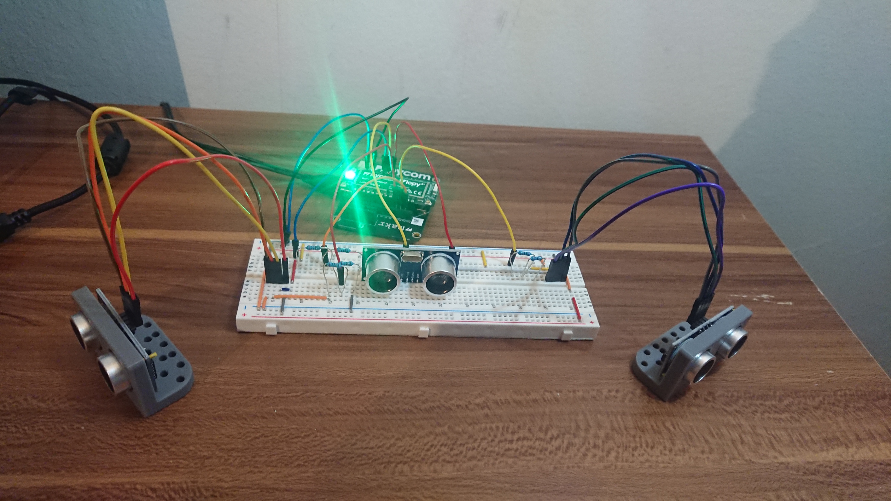
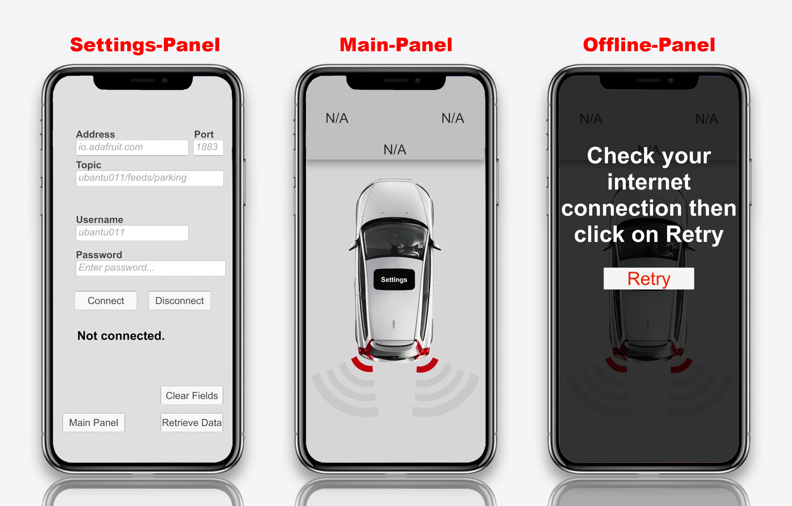

# **Parking radar sensor**

* Ladda ner Appen: 
    * Android [Prototype.apk](https://drive.google.com/file/d/1J4INymdXIyaqrTZJNHQ8nDmvR2BSV0AG/view?usp=sharing) 17 MB
    * Windows [Prototype.zip](https://drive.google.com/file/d/10sR1H_vFRUNZAB479mF9K6l9i8I3TnrY/view?usp=sharing) 20 MB

- Presentation [Youtube video](https://youtu.be/0awrDEnnhnA)
- Bilder [/img](./img/)

# Medlemmar: 
- Abdulla Abu Ainin 
- Charbel Jbielly

# Beskrivning och Bakgrund:
Parking Radar Sensor med Arduino som kommunicerar med en app på android, Radarn är baserad på 3 ultraljud sensorer som upptäcker hinder från 3 olika håll; vänster, höger och mitten.
 Vi har tänkt att sensorerna ska bli ett säkerhetssystem som varnar användaren för kommande hinder. Sensorerna är främst tänkte för bilar. Så att bilen har ett extra skydd som varnar om nära objek/hinder så att man inte ska krocka. Vi bestämde oss för detta projekt för vi tyckte det lät intressant samt en utmaning att ha med tre sensorer istället för en. Vi ska även försvåra arbetet med att göra en applikation som visar värderna från sensorerna. Men allt kommer vara värt det i slutändan.

# Abstract:
Vi började med att bestämma vad vi skulle göra. Vi hade möte med Morgan och fick klartecken att börja jobba. Vi beställde då delar och träffades i biblioteket för att diskutera hur vi skulle gå till väga. Vi jobbade med att konstruera en app som tar emot värden från en mqtt server som tar emot sina värden från kopplingen vi gjorde med tre stycken ultraljud sensorer. Vi använde oss av adafruit för att öppna mqtt server. För appen användes unity och vs code. Och för att få fram current time använde vi atom. Efter varje pass vi arbetade dokumenterade vi i [timelog.md](./doc/timelog.md) vad vi gjorde och hur länge vi jobbade. Vi fortsatte att ha möten med Morgan och fick feedback samt vi diskuterade våra idéer. Slutligen fick vi allting och blir klart. Vi har en fungerande app som tar emot värden från mqtt som tar emot sina värden från våran koppling. Detta är tänkt att fungera som en bilsesnor för att varna användaren om avståndet till objekt/hinder som finns bakom bilen.

# Resultat:
Resultatet blev en app på android som visar värden från  (Parkerings sensorerna) via Mqtt Broker.

## Projektet:

## Appen:

* [/src](./src/)
    * [Project_files](./src/project_files)
    * [App_files](./src/App_files)
---

# Metod:
Filerna med beskrivning:
* [/doc](./doc/)
    * [Hardware.md](./doc/hardware.md)
    * [Setup.md](./doc/setup.md)
    * [Test.md](./doc/test.md)
## Andra filer:
* [/doc](./doc/)
    * [Requirments.md](./doc/requirments.md)
    * [Timelog.md](./doc/timelog.md)
    * [3d Model - Sensor-hållare](./doc/3d_modell)
