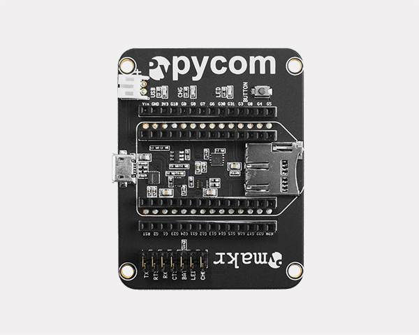
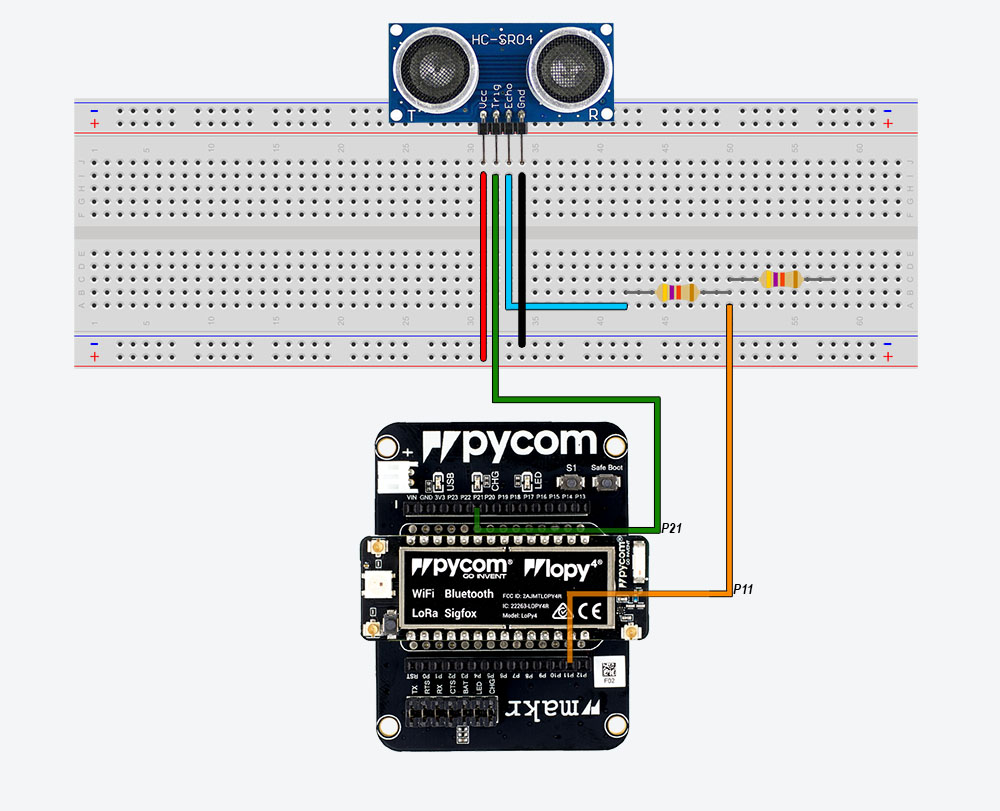
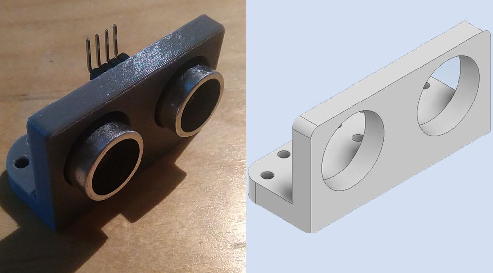
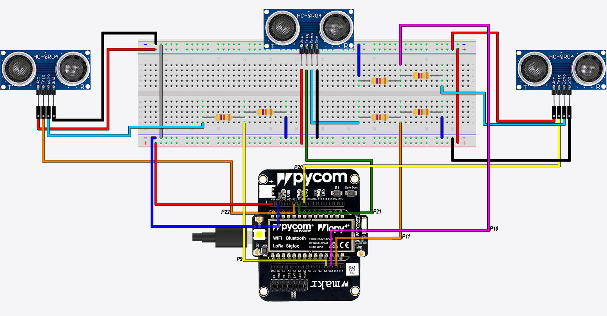

# Sammanfattning:
Den första sensorn kopplas direkt på breadboard och sladdar dras från pycom till breadboarden så att sensorn får ström. De andra två sensorerna kopplas inte fast i breadboarden utan är mer rörliga så att de går att justera. De två lösa sensorerna kopplas via hon-kablar. Till varje sensor behöver vi 2 resistorer. Och alla är kopplade till GND och VIN. (Kan behövas bild på kopplingen)

## Vi behöver följande:

| st |       Item's name       |    Link   |
|----|:-----------------------:|:---------:|
| 3  |         HC-SR04         |    [m.nu](https://www.m.nu/sensorer-matinstrument/hc-sr04-ultrasonic-sensor?gclid=CjwKCAiAudD_BRBXEiwAudakX0ghyEZxe3HA5D5N7k4rrj7Hh61hzJiM_J5gRXt2A8rBqe69zHBhRRoCq0sQAvD_BwE)   |
| 1  |       Pycom lopy 4      |    [m.nu](https://www.m.nu/pycom/lopy4-with-headers)   |
| 1  |   Expansion Board 3.1   |    [m.nu ](https://www.m.nu/pycom/expansion-board-31)  |
|  3,3  |      1k , 2.2k Resistors      | [Amazon.de](https://www.amazon.de/-/en/gp/product/B01M7N4WB6/ref=ppx_yo_dt_b_asin_title_o00_s00?ie=UTF8&psc=1) |
| 1  | breadboard & wiring kit | [Amazon.de](https://www.amazon.de/-/en/gp/product/B01M7N4WB6/ref=ppx_yo_dt_b_asin_title_o00_s00?ie=UTF8&psc=1) |

I HC-SR04 sensorn har vi 4 pins (VCC,TRIG,ECHO,GND). Dessa sensorer behöver 5v så vi kommer att använda VIN pin från Pycom enheten för att använda sensorerna, samtidigt behöver vi minska voltage från 5V till 3,3 för att kunna ansluta den till ECHO då kan vi använda 1 st 1k resistor och 1 st 2.2k resistor för varje sensor.

- Vi börjar först med att koppla lopy4 på expansion boardet:

- Sen kopplas 1 st 1k resistor och 1 st 2k resistorer i breadboarden och ena sensorn kopplas och ansluts till Pycom på följande sätt: ("s1" för första sensorn)
  - LoPy4 VIN <--> s1.VCC
  - LoPy4 P21 <--> s1.TRIG
  - s1.ECHO <--> 2.2k resistor <--> 1k resistor <--> LoPy4 P11
  - LoPy4 GND <--> s1.GND

- Efter det sätter vi de andra 2 sensorerna i våra sensor behållare som vi printat ut för att kunna vrida sensorerna så att vi täcker en större yta.

Och vi ansluter de till breadboarden och till Lopy4 via hane-hona kablar på följande sätt: (s2 sensorn till vänster, 's3' sensor till höger)
  - LoPy4 VIN <--> s2.VCC , s3.VCC
  - LoPy4 P21 <--> s2.TRIG
  - LoPy4 P20 <--> s3.TRIG
  - s2.ECHO <--> 2.2k resistor <--> 1k resistor <--> LoPy4 P11
  - s3.ECHO <--> 2.2k resistor <--> 1k resistor <--> LoPy4 P10
  - LoPy4 GND <--> s2.GND, s3.GND

- Sen kopplar vi enheten till en el uttag som supportar 5 Voltage och då lyser ett grönt ljus på Lopy 4 om vi är kopplade till nätverket utan problem.
