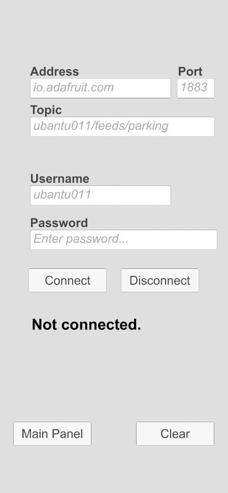
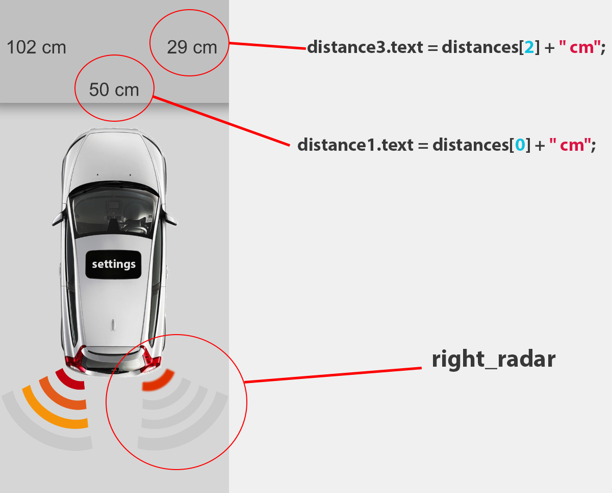
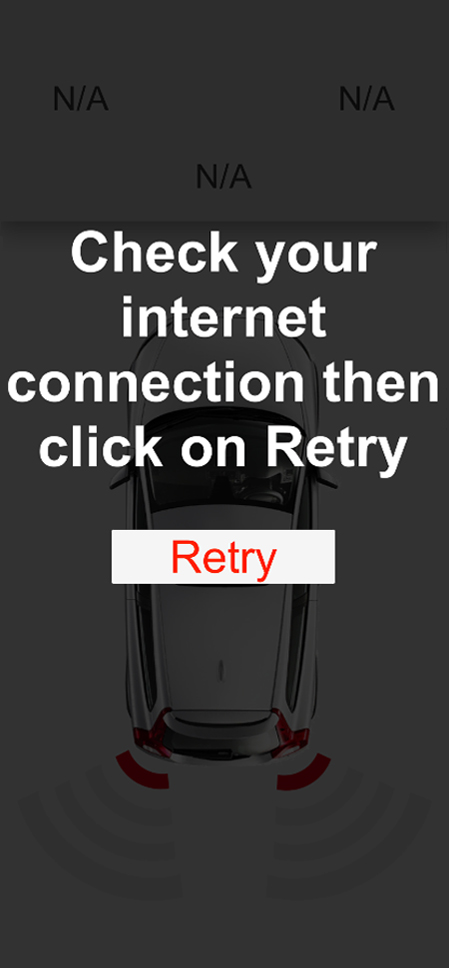

# Sammanfattning:
Vi använde atom, unity, Visual studio code och adafruit. Vi använde atom för att skriva fram kod som tar fram de olika värden från sensorerna, och skicka dessa till Adafruit via MQTT. Adafruit använde vi för att öppna en mqtt server där data togs emot från sensorerna som sedan skickas till appen. Unity är en engine som vi använde för att konstruera appen. Det användes också Visual studio code för att skriva kod i unity. Så slutprodukten blir sensorer som skickar avståndet från ett objekt till en mqtt server som senare skickas vidare till en app som 

## Projektet (Pycom ---> Adafruit):
Först så behöver vi koppla oss till Wifi för att kunna skicka data till Adafruit via Mqtt. Via koden: [wifi.py](https://gitlab.lnu.se/1dt308/student/team-14/-/blob/master/src/project_files/wifi.py)

Sen tar vi in distanser från sensorerna, Ultrasonic sensorer räknar tiden i millisekunder och ljud hastigheten är 340m/s eller .034cm/us. Och vi vet att vi behöver dela tiden vi får med _2_ på grund av att sensoren räknar tiden som behövs för pulsen att resa fram och tillbaka.
Då får vi formeln:
`Distance = (Time(us) * .034) / 2` .

Och vi samlar alla 3 distanser i en string och och avnänder ";" så vi kan skilja ut de i appen sen.
``` python  
string = distance + distance2 + distance3 # string = "0;0;0";
``` 
 Sen skickas de till Adafruit. Vi prenumererade på Adafruit-Plus för att kunna utnyttja maximala antal data points. och det är **60 data points per minut** vilket innebär att vi måste vänta en sekund för att skicka ett nytt värde till Adafruit. 
 
 Kod i Python: [main.py](https://gitlab.lnu.se/1dt308/student/team-14/-/blob/master/src/project_files/main.py)


**Resultatet:**


## Appen (Adafruit ---> Unity):

Unity är faktiskt en spel engine där det är jätte lätt att skapa en prototyp app för Android eller IOS.
Och vi hade tur att det finns ett färdig open source projekt på nätet som tolkar Mqtt connection till Unity [link](https://github.com/eclipse/paho.mqtt.m2mqtt) så vi behövde bara ändra i källkoden så att användaren kan mata in Mqtt uppgifterna (address, port, username, password, topic-address) I en "settings panel". 

Se hela koden med kommentarerna. [här](https://gitlab.lnu.se/1dt308/student/team-14/-/blob/master/src/App_files/Mqtt_to_unity.cs) 

Bild på Settings-panel:



Efter det behövde vi ta in stringen som skickas från Pycom och dela ut den till 3 variabler, (distance_middle, distance_right och distance_left).

Kod i csharp: [Mqtt_to_unity.cs](https://gitlab.lnu.se/1dt308/student/team-14/-/blob/master/src/App_files/Mqtt_to_unity.cs)
``` csharp 
private void ProcessMessage(string msg)
{
string[] distances = {"0"};
string divide="";

foreach (char c in msg)
{

    if (c.ToString()==";")
    {
        if (distances[0]=="0")
        {
            distances[0]=divide;
            distance1_int= int.Parse(divide);           // int (distans) ska användas i ui-scripting.cs för att animira radarerna.
            if (distance1_int<=250)
            {
                distance1.text=distances[0] + " cm"; //distance1.text är en text field som vi ser i skärmen. (se figuren(2))
            }
            else
            {
                distance1.text=">250";
            }
            divide="";
        }
    }
    else
    {
     divide+=c;
    }
}
```

Bild på Main-panel med kommentar:



Efter det animerade vi 2 radarer som rör sig beroende på värdena från sensorna.
De har 4 steg.


- **Rött** lyser när avståndet är mindre 30 cm.
- **Orange** lyser när avståndet är mindre än 75 men större än 30 cm.
- **Gul**; lyser när avståndet är mindre än 150 cm och större än 75 cm.
- **Grönt**; lyser när avståndet är större än 150 cm.

På grund av att vi har 3 sensorer och bara 2 radarer. Så bestämdes det att göra sensoren i mitten till "Main Sensor" det innebär att om värdet på denna sensor är mindre än de andra 2 sensorerna, då ska värdet på den bestämma över animationen på de 2 radarer. Se koden med kommentarer:

Kod i csharp: [UI_scripting.cs](https://gitlab.lnu.se/1dt308/student/team-14/-/blob/master/src/App_files/UI_scripting.cs)
``` csharp 
    IEnumerator comparing()
    {
        M2MqttUnityTest M2MqttUnityTest = this.GetComponent<M2MqttUnityTest>(); /*importerar scripten "M2MqttUnityTest.cs"
                                                                                    med alla värden i.*/
        yield return new WaitForSeconds(0.01F);             /*Vi behöver lägga den här för att det tar några millisekunder
                                                         att få värden från sensorerna till appen.*/
        string objectname;
        int distance_middle = M2MqttUnityTest.distance1_int;           // Importerar distans värdet från sensorn i mitten 'här;0;0;'
        int distance_left = M2MqttUnityTest.distance3_int;              //0;0;här;
        int distance_right = M2MqttUnityTest.distance2_int;             //0;här;0;

        if (distance_middle<= distance_left && distance_middle<= distance_right) /* Vi jämför mellan distanserna och om värdet 
                                                                                från mitten sensorn är mindre än de andra då 
                                                                                kör vi följande funktionen som påverkar 
                                                                                både höger och vänster radars.*/
        {
            objectname="left_radar";
            radar_animation(distance_middle,objectname);
            objectname="right_radar";
            radar_animation(distance_middle,objectname);
        }
        else 
        {
            objectname="left_radar";
            radar_animation(distance_left,objectname);
            objectname="right_radar";
            radar_animation(distance_right,objectname);
        }
    }

    private void radar_animation(int distance, string objectname)  // funktionen ändrar animation på högra radarn.  
    {                                               
            radar = GameObject.Find(objectname);            //GameObject.Find(string) hittar objekt via dess namn.
            if (distance>=150)                         // om avståndet mellan hinder och sensorn större än 150 cm
                                                       // då 'lyser' alla färgerna på radarn.
            {
                radar.GetComponent<Animator>().Play("full");
            }

            else if (150>distance && distance>=75)
            {
                radar.GetComponent<Animator>().Play("orange");
            }

            else if (75>distance && distance>=30)
            {
                radar.GetComponent<Animator>().Play("dark_orange");
            }

            else if (distance<30)
            {
                radar.GetComponent<Animator>().Play("red");
            }
     }
``` 
## Undvika fel i Pycom & Appen:

för att undvika eventuella anslutnings fel från Pycom enheten har vi lagt in följande i en While loop:

Kod i Python: [main.py](https://gitlab.lnu.se/1dt308/student/team-14/-/blob/master/src/project_files/main.py)
``` python

while True:
    # Checking connection.
    if not wlan.isconnected():
        connect_wifi()
    elif adafruit_connected==False:     #Global variabel som blir True om man kör adafruit_connect()
        adafruit_connect()

``` 
---
Och för att undvika samma problem i Appen har vi skrivit en kod som kollar nätverksanslutning varje millisekund, och om vi inte är anslutna så dyker en panel upp med knappen "Retry" som kör funktionen restart() (se koden ner) och då laddas allt om och kollat återigen om vi är anslutna.

Kod i csharp: [check_connection.cs](https://gitlab.lnu.se/1dt308/student/team-14/-/blob/master/src/App_files/check_connection.cs)
``` csharp
//Kollar network connection varje sekund.
yield return new WaitForSeconds(1);
if (Application.internetReachability == NetworkReachability.NotReachable)
        {
            offlinepanel.SetActive(true); // Detta Gör en panel "Offline_Panel" visible om det finns ingen connection.
        }


```

Bild på Offline Panel:


