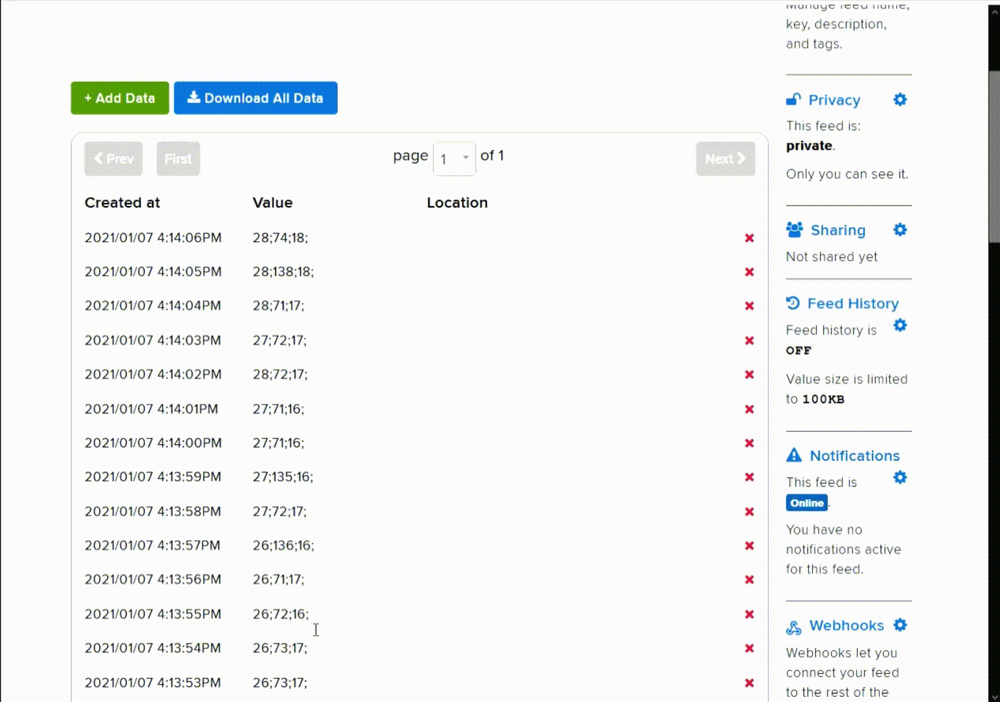

# Sammanfattning:
Kopplingen var rätt enkel. Men sensorerna testades en gång i taget för att se om vi fick individuella värden. När det funkade så testades alla sensorer samtidigt. Det uppstod ett problem som vi även skrivit in i en [issue](https://gitlab.lnu.se/1dt308/student/team-14/-/issues/1) på gitlab. Det är att pycom kopplas från atom för att det är för hög strömförbrukning. Lösningen på detta var att koppla bort GND när vi skulle ladda upp ny kod till pycom. Och sen ansluta till en strömkälla som klarar av 5V och även koppla upp till mqtt servern för att få resultatet.

## Att testa sensorerna:
Vi testat sesorerna genom att hålla en objekt och röra den runt och se vilka resultat vi får med det.

För hållbarhetens skull har vi testat att hålla Pycom enheten på i 2 timmar, och den fungerade som den ska med appen och sensorerna.

Resultatet på Adafruit feed:

## Att testa appen:
Det går att testa appen genom att ladda ner den till en android enhet [prototype.apk](https://drive.google.com/file/d/1bIwu2aPql3wvMc3xpz3gCrHTkoWRGxV1/view?usp=sharing) eller windows [prototype.zip](https://drive.google.com/file/d/10sR1H_vFRUNZAB479mF9K6l9i8I3TnrY/view?usp=sharing) och testa funktionerna i den som till example att koppla den till en Mqtt server och skicka en string till den som innehåller 3 integraler på sådant sätt: ("0;0;0;") och se hur radarerna reagerar.

Exempel på result:

